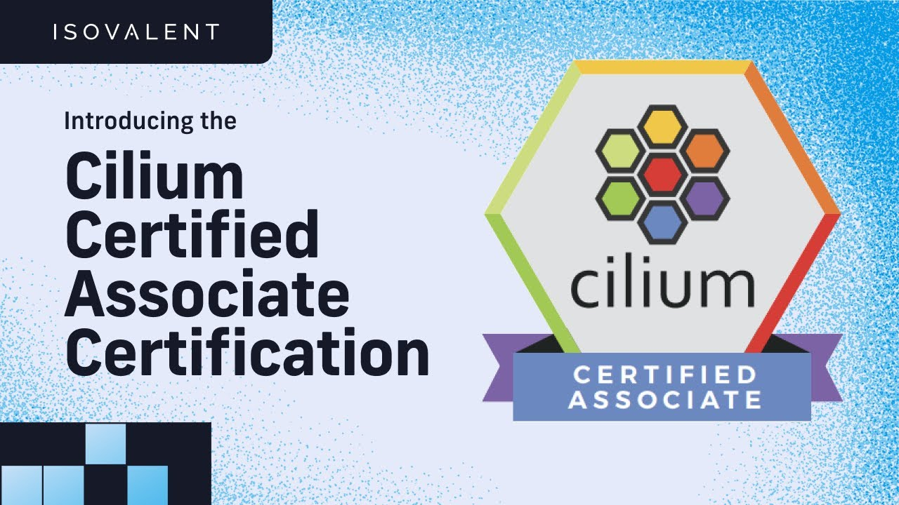

# CIlium Certified Associate Study Guide

The aim of this study guide is to help the Cilium community prepare for the [Cilium Certified Associate(CCA)](https://training.linuxfoundation.org/certification/cilium-certified-associate-cca/) Exam 🐝

## About the Certification
Here is all you need to know about the exam and certification.

- Who is the exam for?
  - The CCA is an entry-level certification certification designed for platform or cloud engineers with interests in networking, security and observability. Ideal candidates may have achieved Kubernetes certifications such as KCNA, CKA, or CKAD or have completed Cilium-specific training.

 

- How much does the exam cost?
  - I expect the exam to cost the same as other associate level exams like the ICA and the PCA - $250

 

- How long does the exam last?
  - Candidates are allowed 90 minutes to complete the exam.

 

- What score is needed to pass the exam?
  - A score of 75% or above must be earned to pass the exam.

 

- How long is the certification valid for?
  - The Certification is valid for 3 years per the Linux Foundation certification rules

## Study Guide
In this section, I've put together a bunch of resources that match the Exam blueprint. This should help the Cilium Community get ready and study for the exam effectively.

### Architecture - 20%
**Requirement**
- Understand the Role of Cilium in Kubernetes Environments
- Cilium Architecture
- IP Address Management (IPAM) with Cilium
- Cilium Component Roles
- Datapath Models

**Resources**
- [Getting Started with Cilium - Lab](https://isovalent.com/labs/getting-started-with-cilium/) 🥼
- [Cilium - Rethinking Linux Networking and Security for the Age of Microservices](https://cilium.io/blog/2018/04/24/cilium-security-for-age-of-microservices/) 📖
- [Cilium 1.0: Bringing the BPF Revolution to Kubernetes Networking and Security](https://cilium.io/blog/2018/04/24/cilium-10/) 📖
- [Cilium Component Overview - Cilium Docs](https://docs.cilium.io/en/stable/overview/component-overview/) 📖
- [LinuxFoundationX: Introduction to Cilium](https://www.edx.org/learn/kubernetes/the-linux-foundation-introduction-to-cilium) 📖
- [Cilium eBPF Datapath - Cilium Docs](https://docs.cilium.io/en/stable/network/ebpf/) 📖
- [IP Address Management (IPAM) - Cilium Docs](https://docs.cilium.io/en/stable/network/concepts/ipam/) 📖
- [Cilium Technical Deep Dive: Under the Hood - Talk](https://www.youtube.com/watch?v=UZg_2SXDKis) 📺
- [Cilium's BPF kernel datapath revamped - Talk](https://www.youtube.com/watch?v=u0PGas8D24w) 📺

### Network Policy - 18%
**Requirement**
- Interpret Cilium Network Polices and Intent
- Understand Cilium's Identity-based Network Security Model
- Policy Enforcement Modes
- Policy Rule Structure
- Kubernetes Network Policies versus Cilium Network Policies

**Resources**
- [Identity Based - Cilium Docs](https://docs.cilium.io/en/stable/security/network/identity/) 📖
- [Network Policy Use Cases](https://cilium.io/use-cases/network-policy/) 📖
- [From IP to identity: making cattle out of pets in cloud native](https://www.cncf.io/blog/2023/07/24/from-ip-to-identity-making-cattle-out-of-pets-in-cloud-native/) 📖
- [Zero Trust Security with Cilium](https://isovalent.com/blog/post/zero-trust-security-with-cilium/) 📖
- [Network Policy - Cilium Docs](https://docs.cilium.io/en/latest/security/policy/) 📖
- [Policy Enforcement Mode - Cilium Docs](https://docs.cilium.io/en/latest/security/policy/intro/) 📖
- [Why is Kubernetes Network Policy important?](https://youtu.be/5sc4R-wk7uo) 📺
- [Birth of Kubernetes Network Policy](https://youtu.be/x69ofJYr71g) 📺
- [NetworkPolicy Tutorial](https://github.com/networkpolicy/tutorial) 📖
- [eCHO Episode 43: Deep dive on FQDN Policy](https://www.youtube.com/watch?v=iJ98HRZi8hM) 📺
- [Network Policy Editor](https://networkpolicy.io/) 📖

### Service Mesh - 16%
**Requirement**
- Know How to use Ingress or Gateway API for Ingress Routing
- Service Mesh Use Cases
- Understand the Benefits of Gateway API over Ingress
- Encrypting Traffic in Transit with Cilium
- Sidecar-based versus Sidecarless Architectures

**Resources**
- [How eBPF will solve Service Mesh – Goodbye Sidecars](https://isovalent.com/blog/post/2021-12-08-ebpf-servicemesh/) 📖
- [Cilium Service Mesh Use Cases](https://cilium.io/use-cases/service-mesh/) 📖
- [Service Mesh Architectures Explained - Sidecar and Beyond](https://youtu.be/j7JKkbAiWuI?si=6jWl3GQ6CjVLHBFJ) 📺
- [Cilium Service Mesh – Everything You Need to Know](https://isovalent.com/blog/post/cilium-service-mesh/) 📖
- [Cilium Ingress Controller - Lab](https://isovalent.com/labs/cilium-ingress-controller/) 🥼
- [Cilium Transparent Encryption with IPSec and WireGuard - Lab](https://isovalent.com/labs/cilium-transparent-encryption-with-ipsec-and-wireguard/) 🥼
- [Gateway API support - Cilium Docs](https://docs.cilium.io/en/stable/network/servicemesh/gateway-api/gateway-api/) 📖
- [Cilium Gateway API - Lab](https://isovalent.com/labs/gateway-api/) 🥼
- [Advanced Gateway API Use Cases - Lab](https://isovalent.com/labs/advanced-gateway-api-use-cases/) 📖
- [Ingress Controllers or the Kubernetes Gateway API? Which Is Right for You?](https://thenewstack.io/ingress-controllers-or-the-kubernetes-gateway-api-which-is-right-for-you/) 📖
- [A Deep Dive into Cilium Gateway API: The Future of Ingress Traffic Routing](https://isovalent.com/blog/post/cilium-gateway-api/) 📖
- [Cilium Gateway API - Youtube Playlist](https://youtube.com/playlist?list=PLngi_1qThAPCiulGkrufXeN_ibmKZDCia&si=Hijz5I83OuM0Yonr) 📺

### Network Observability - 10%
**Requirement**
- Understand the Observability Capabilities of Hubble
- Enabling Layer 7 Protocol Visibility
- Know How to Use Hubble from the Command Line or the Hubble UI

**Resources**
- [eCHO episode 2: Introduction to Hubble](https://www.youtube.com/live/hD2iJUyIXQw?si=WqWaY7_jN2B-sRz5) 📺
- [Observability Use Cases](https://cilium.io/#observability) 📖
- [Setting up Hubble Observability](https://docs.cilium.io/en/latest/gettingstarted/hubble_setup/#hubble-setup) 📖
- [Layer 7 Protocol Visibility - Cilium Docs](https://docs.cilium.io/en/stable/observability/visibility/) 📖
- [Back to Basics – L7 Flow Visibility](https://isovalent.com/videos/back-to-basics-l7-flow-visibility/) 📺
- [Cilium IPv6 Networking and Observability - Lab](https://isovalent.com/labs/ipv6-networking-and-observability/) 🥼

### Installation and Configuration - 10%
**Requirement**
- Know How to Use Cilium CLI to Query and Modify the Configuration
- Using Cilium CLI to Install Cilium, Run Connectivity Tests, and Monitor its Status

**Resources**
- [Cilium Quick Installation](https://docs.cilium.io/en/latest/gettingstarted/k8s-install-default/#k8s-install-quick) 📖
- [eCHO episode 1: Introduction to Cilium](https://www.youtube.com/watch?v=80OYrzS1dCA&list=PLDg_GiBbAx-mY3VFLPbLHcxo6wUjejAOC&index=114) 📺
- [Getting Started with Cilium - Lab](https://isovalent.com/labs/getting-started-with-cilium/) 🥼
- [Tutorial: Tips and Tricks to install Cilium](https://isovalent.com/blog/post/tutorial-tips-and-tricks-to-install-cilium/) 📖

### Cluster Mesh - 10%
**Requirement**
- Understand the Benefits of Cluster Mesh for Multi-cluster Connectivity
- Achieve Service Discovery and Load Balancing Across Clusters with Cluster Mesh

**Resources**
- [Cilium Cluster Mesh Use Cases](https://cilium.io/use-cases/cluster-mesh/) 📖
- [Cilium Cluster Mesh - Lab](https://isovalent.com/labs/cilium-cluster-mesh/) 🥼
- [Connecting Klusters on the Edge with Deep Dive into Cilium Cluster Mesh - Talk](https://www.youtube.com/watch?v=UcsEVnFtrLY) 📺
- [An Introduction to Cilium Cluster Mesh](https://www.youtube.com/watch?v=4bJkk7ghx7A) 📺
- [eCHO episode 41: Cilium Cluster Mesh](https://www.youtube.com/watch?v=VBOONHW65NU) 📺
- [eCHO Episode 94: Cluster API and Cilium Cluster Mesh](https://m.youtube.com/watch?v=HVqQhMRpUR4&pp=ygUKI2Fic29saXRlbQ%3D%3D) 📺

## eBPF - 18%
**Requirement**
- Understand the Role of eBPF in Cilium
- eBPF Key Benefits
- eBPF-based Platforms versus IPtables-based Platforms

**Resources**
- [Why is the kernel community replacing iptables with BPF?](https://cilium.io/blog/2018/04/17/why-is-the-kernel-community-replacing-iptables/) 📖
- [CNI Benchmark: Understanding Cilium Network Performance](https://cilium.io/blog/2021/05/11/cni-benchmark/) 📖
- [eBPF - The Future of Networking & Security](https://cilium.io/blog/2020/11/10/ebpf-future-of-networking/) 📖
- [What is eBPF?](https://ebpf.io/what-is-ebpf/) 📖
- [Getting started with eBPF - Lab](https://isovalent.com/labs/getting-started-with-ebpf/) 🥼

### BGP and External Networking 6%
**Requirement**
- Egress Connectivity Requirements
- Understand Options to Connect Cilium-managed Clusters with External Networks

**Resources**
- [Cilium BGP Use Cases](https://cilium.io/use-cases/bgp/) 📖
- [Cilium BGP Control Plane](https://docs.cilium.io/en/stable/network/bgp-control-plane/) 📖
- [Cilium BGP Service Advertisement](https://www.youtube.com/watch?v=Nzh2jc6qW6Y) 📺
- [BGP on Cilium - Lab](https://isovalent.com/labs/bgp-on-cilium/) 🥼
- [Cilium LoadBalancer IPAM and BGP Service Advertisement - Lab](https://isovalent.com/labs/lb-ipam-bgp-service/) 🥼
- [Advanced BGP Features - Lab](https://isovalent.com/labs/advanced-bgp-features/) 🥼
- [BGP with Cilium](https://nicovibert.com/2022/07/21/bgp-with-cilium/) 📖
- [Connecting your Kubernetes island to your network with Cilium BGP](https://isovalent.com/blog/post/connecting-your-kubernetes-island-to-your-network-with-cilium-bgp/) 📖
